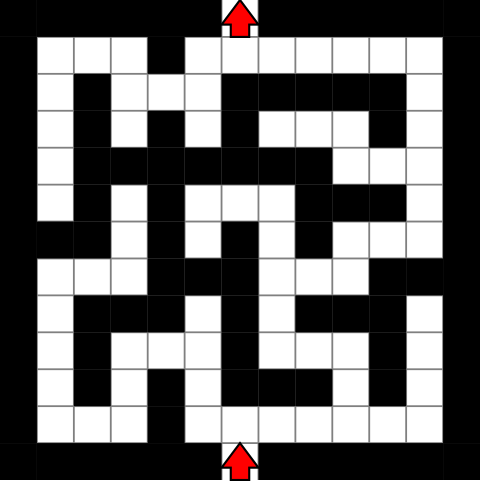
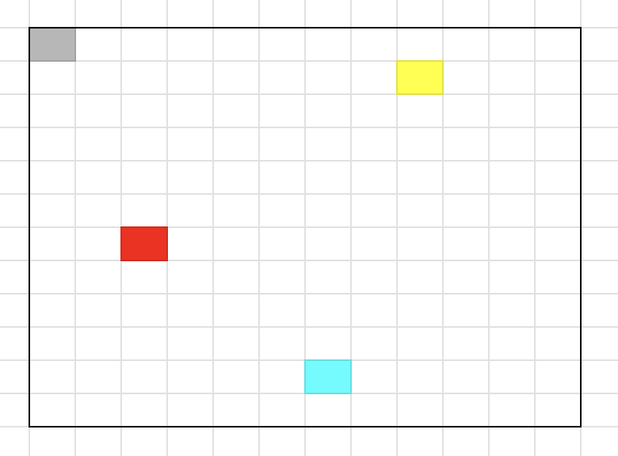

# Unit 2.1 Assignment: MazePractice

## Introduction

This assignment is supposed to give you some hands-on practice using contructors and methods on a maze object from the maze classes. Before starting this assignment you should be familiar with the following topics:
- What are classes?
- What are objects?
- Using Constructors
- Using Methods

One of my expectations is that you will look up information that you don't know yet. Some assignments include information that you haven't learned yet. This was done on purpose. Take the time to do your research on them and experiment with them.

**Be very cautious about using AI. It is a powerful tool, but it can lead to blindly copying and pasting directly into code. I ask that if you use AI, prompt it with questions, not commands.**

## Install Instructions

TODO: Write the instructions to install this folder

## Assignment Instructions

Open the MazePractice.java file and read through the comments. This is where all your code will go. DO NOT MODIFY Maze.java. This assignment is quite simple, get to the end of the maze. Here is the maze that you'll be solving:



DO NOT MODIFY Maze.txt. If you look in the Maze.txt file, you will see the same image inside as a text file matrix. Your character is '@', the walls are 'X', the open space to move through is ' ' (space character), and the finishing square is 'E'.

Using methods given to you in the Maze.java file, you have to move through the maze and get to the end. Here are the methods that you can use:
```java
/**
 * Constructor: creates the maze object
 * 
 * @param width  - The width of the maze.
 * @param height - The height of the maze.
 * @param x_pos  - The X-coordinate position of your character.
 * @param y_pos  - The Y-coordinate position of your character.
 *
 * @return none
 */
public Maze(int width, int height, int x_pos, int y_pos);
```

When creating the maze, it may be easier to go inside the maze.txt file to calculate the width, height, x-coordinate, and y-coordinate of the maze. The x-coordinate and y-coordinate are 0-based from the top left corner (i.e. the top left corner of the maze is (0, 0) on a graph). Moving down will increase the y-coordinate and moving to the right will increase the x-coordinate. If you move up or to the left, you'll decrease the respective coordinates. For example:



The grey box is (0, 0) since its the top left. The red box is (2, 6). The yellow box is (8, 1). The blue box is (6, 10).

```java
/**
 * Turns your character to the right
 * 
 * @param none
 *
 * @return none
 */
public void turnRight();

/**
 * Turns your character to the left
 * 
 * @param none
 *
 * @return none
 */
public void turnLeft();

/**
 * Moves your character forward 1 space
 * 
 * @param none
 *
 * @return none
 */
public void moveForward();
```
When you create the maze, your character will start off facing north. If you want to face east, you can either use the turnRight() method once or the turnLeft method 3 times. The same logic can apply to the south and west. To move forward, simply call the moveForward() method.

## How to check your work?

To begin this assignment, you must run this command. You only have to do this once. This will turn the Maze.java class into a .class extension, which will be used to run your work.
```bash
javac Maze.java
```

To check to see if your code is correct, run the following commands in your terminal:

```bash
java MazePractice.java
```

If the output is: "Finished the Maze!", then you have completed the assignment. If you hit a wall or go out of bounds, the code will output the result. This ONLY works if you haven't modified the code in Maze.java.

Let's say you move and want to see where your character is in the maze, you can do that with this method:
```java
/**
 * Prints out the maze with your current position
 * 
 * @param none
 *
 * @return none
 */
public void print();
```
This will be very helpful during the debugging phase.

## Think you found a bug or a typo?

Please send me an email explaining where you believe you have found either a typo or a bug in the program. You can email me at daniel.tutors12@gmail.com. Try your best to explain the bug/typo to me and provide screenshots of the code/output if you can.

